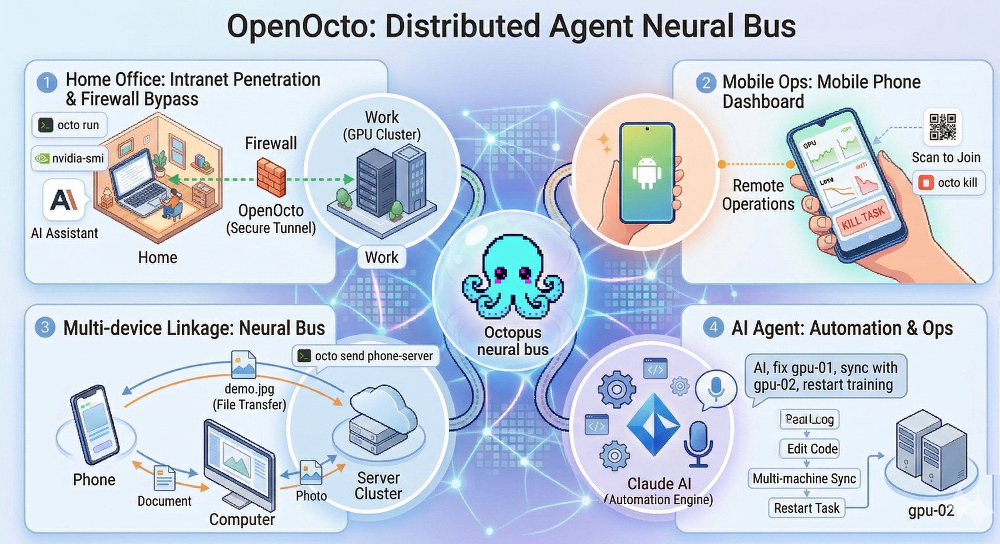

<p align="center">
  
</p>

<h1 align="center">OpenOcto</h1>

<p align="center">Any time, any device, anything.</p>

> **Too many devices? Let Octo handle it.**

<p align="center">
  
</p>

<p align="center"><a href="README_CN.md">中文文档</a></p>

- [x] Work from home, remotely control GPU servers behind firewalls.
- [x] On the go, monitor device status and run commands from your phone.
- [x] Multi-device collaboration and management — leave it to Octo.
- [x] Compatible with Claude Code and MCP.
- [x] Firewall-proof.

## How It Works

```
┌──────────────┐         ┌───────────────┐         ┌──────────────┐
│  Your Agent  │  HTTP   │  Redis Relay  │  HTTP   │  Remote GPU  │
│ (Claude Code)│────────>│  (Upstash)    │<────────│ (octo daemon)│
│              │         │  serverless   │         │              │
│ MCP / CLI    │         │  free tier    │         │  any machine │
└──────────────┘         └───────────────┘         └──────────────┘
```

- **Agent side**: sends tasks via MCP tools or CLI commands
- **Relay**: built-in free relay (or your own Upstash Redis for full privacy)
- **Worker side**: daemon polls for tasks, executes, streams results back

Both sides only make **outbound HTTP requests**. No inbound ports, no SSH tunnels, no VPN.

## Quick Start

### 1. Install & configure (local machine)

```bash
pip install openocto
octo setup             # AI-guided setup — walks you through everything interactively
```

Optional extras:

```bash
pip install "openocto[qr]"       # QR output for `octo token --qr`
pip install "openocto[nearby]"   # BLE + encrypted nearby transfer
pip install "openocto[metrics]"  # TensorBoard/tfevents parsing helpers
```

> `octo setup` uses a free LLM — no API key needed. It detects your environment, configures the relay, and optionally sets up an LLM provider, all through conversation.
>
> Prefer manual setup? Use `octo init` instead.

### 2. Start a worker (remote machine)

**Option A** — Install directly on the remote:

```bash
pip install openocto
octo join --token "$(octo token)" --name gpu --tags "gpu,cuda"
```

> Run `octo token` on your local machine first to get a join token. This avoids repeating `octo init` on every machine.

**Option B** — Remote has no internet? Use a jump server with `--ssh`:

```bash
# On a jump server that can SSH into the GPU machine:
octo join --token "..." --name gpu --tags "gpu,cuda" --ssh "user@gpu-internal-ip"
```

### 3. Use it

```bash
octo ls                              # See all terminals
octo run gpu "nvidia-smi"            # Run a command
octo run gpu "python train.py"       # Start training
octo run gpu "python train.py" --notify phone  # Notify phone when done
octo cat gpu /work/model.py          # Read a remote file
octo edit gpu /work/config.py --old "lr=0.001" --new "lr=0.0005"
octo kill gpu                        # Kill running command
```

### 4. Connect your AI agent (optional)

Add to `.mcp.json` in your project:

```json
{
  "mcpServers": {
    "openocto": {
      "command": "octo",
      "args": ["mcp-server"]
    }
  }
}
```

Claude Code (or any MCP-compatible agent) can now control your remote terminals directly.

## Training Notifications

Get notified on your phone when a training job finishes — or fails:

```bash
octo run gpu "python train.py" --notify phone
octo run gpu "python train.py" --notify phone --notify-message "Experiment A done"
```

Works across firewalls. The notification pops up as a system notification on your phone (lock screen visible).

## MCP Tools

| Tool | Description |
|---|---|
| `remote_ls` | List all terminals with status, mode, and tags |
| `remote_run(terminal, command)` | Execute a shell command (streaming output) |
| `remote_read(terminal, path)` | Read a file with line numbers |
| `remote_edit(terminal, path, old, new)` | Edit a file by string replacement |
| `remote_glob(terminal, pattern)` | Search files by glob pattern |
| `remote_grep(terminal, pattern)` | Search file contents by regex |
| `remote_kill(terminal)` | Kill running command |
| `remote_logs(terminal)` | View output of current or last task |
| `remote_send(source, target, file)` | Transfer files between terminals |
| `remote_metrics(terminal)` | GPU status and training metrics |
| `remote_wake / remote_cool` | Control polling mode |

## GPU Metrics

Monitor GPU utilization, VRAM, temperature, and training loss — from CLI, web browser, or phone.

```bash
octo metrics gpu                    # One-shot: print GPU status + training metrics
octo metrics --dashboard            # Open web dashboard (all GPU servers)
```

The daemon reads `nvidia-smi` and TensorBoard tfevents files. No code changes needed in your training scripts.

## File Transfer

```bash
octo send local gpu ~/data/dataset.tar.gz --dest /work/data/dataset.tar.gz
```

Smart routing picks the fastest path:

| Route | When | Speed |
|---|---|---|
| **LAN direct** | Same network | Full LAN speed |
| **Redis relay** | File < 512KB | Instant |
| **Cloud storage** | Large files, different networks | S3 upload → presigned URL → download |

Cloud storage setup (optional): `octo config --storage` — supports Cloudflare R2, AWS S3, or any S3-compatible service.

## Configuration

### Relay

`octo init` offers two options:

| Option | Setup | Privacy |
|--------|-------|---------|
| **Free relay** (default) | Instant, no account needed | Isolated by random workspace ID |
| **Own Redis** | Create free at [upstash.com](https://upstash.com) | Full privacy, your own instance |

**Adding more machines** — use a join token instead of repeating `octo init`:

```bash
octo token                    # prints octo://eyJ...
octo token --qr               # or show QR code (for phone)
```

### Cloud Storage (optional)

For large file transfers between terminals on different networks:

```bash
octo config --storage         # S3 endpoint, keys, bucket
```

Works with Cloudflare R2 (free 10GB), AWS S3, MinIO, or any S3-compatible service.

### CF Worker Proxy (optional)

For team use with own Redis — deploy the included Cloudflare Worker so members don't need direct Redis credentials. See [`cf-worker/`](cf-worker/).

## Permissions & Security

**Personal mode** (default): anyone with the relay credentials has full access. Fine for solo use.

**Public mode**: for shared environments (lab teams, multi-user setups):

```bash
octo network create mylab --public
octo register alice                       # Generate Ed25519 keypair
octo invite gpu --role readwrite          # Share access
```

Roles: `full` (shell + kill + edit) / `readwrite` (read + edit) / `readonly` (read only)

Every task is signed with the sender's Ed25519 key and verified by the daemon before execution.

## Android App

The companion app turns your phone into an OpenOcto node:

- Scan QR code to join a network
- Run as a background daemon
- View GPU metrics with auto-refresh
- Receive training notifications
- Chinese / English language support

Source: [`android/`](android/)

## Architecture

```
src/openocto/
├── relay.py              Upstash Redis REST client (atomic Lua CAS)
├── daemon.py             Worker: poll, execute, stream results
├── cli.py                CLI (20+ subcommands)
├── mcp_server.py         MCP server (11 structured tools)
├── storage.py            S3-compatible file transfer (parallel multipart)
├── permissions.py        Role-based ACL engine
├── signing.py            Ed25519 task signing & verification
├── config.py             Config & join token encoding
├── metrics_dashboard.py  GPU metrics web dashboard
└── agent_md.py           CLAUDE.md generator
```

- **Core install stays small** — QR, nearby transfer, and metrics parsing are available via optional extras
- **Protocol**: JSON tasks in Redis, lifecycle `PENDING → RUNNING → DONE`
- **Security**: Ed25519 signed tasks, role-based ACL, path validation, atomic CAS updates

## CLI Reference

```
Setup:
  octo setup                             AI-guided setup wizard (recommended)
  octo init                              Manual relay configuration
  octo token [--qr]                      Generate join token
  octo join --name NAME [options]        Start daemon
       --tags T                          Comma-separated tags
       --ssh user@host                   Forward via SSH
       --daemon                          Run in background

Remote Operations:
  octo run TARGET "COMMAND"              Execute command
       --notify TERMINAL                 Notify when done
       --notify-message MSG              Custom notification message
  octo cat TARGET /path                  Read file
  octo edit TARGET /path --old X --new Y Edit file
  octo glob TARGET "**/*.py"             Search files by pattern
  octo grep TARGET "pattern"             Search file contents
  octo logs TARGET [-f] [--tail N]       View task output
  octo kill TARGET                       Kill running command
  octo send SOURCE TARGET FILE           Transfer file
  octo metrics TARGET                    GPU + training metrics
  octo metrics --dashboard               Open web dashboard

Terminal Management:
  octo ls                                List all terminals
  octo wake TARGET                       Fast polling
  octo cool TARGET                       Low-power polling

Network & Permissions:
  octo network create NAME [--public]    Create network
  octo register NAME                     Register device identity
  octo invite TARGET --role ROLE         Generate invite
  octo acl TARGET [--default R]          Manage access

Agent:
  octo agent-md                          Generate CLAUDE.md
  octo mcp-server                        Start MCP server
```

## Troubleshooting

| Problem | Solution |
|---|---|
| "OpenOcto not configured" | Run `octo init` |
| Terminal shows "offline" | Daemon not running, check `~/.octo/daemon.log` |
| Command hangs | `octo kill TARGET` or Ctrl+C |
| Slow first response | Terminal in cool mode, auto-wakes on task (up to 60s) |
| `pkill -f` kills the wrapper | Use bracket trick: `pkill -f "[t]rain_script"` |
| Windows: `python3` not found | Daemon auto-detects `python` on Windows |
| `CERTIFICATE_VERIFY_FAILED` on Windows / corporate networks | Your Python environment may not trust the system or corporate proxy CA. Try `pip install pip-system-certs`, then restart the terminal and retry. This is common with Conda/Miniforge behind HTTPS-inspecting firewalls. |

## License

Apache 2.0
